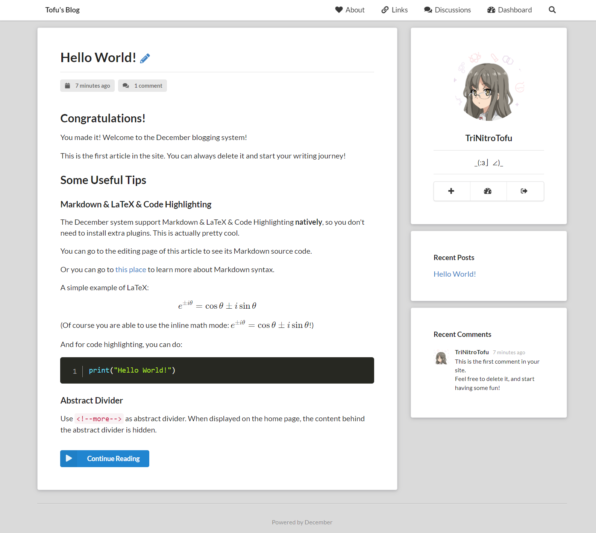

# December


Welcome to the December blogging system's code repository!

## Introduction

December is a minimalist personal blogging system that natively supports Markdown, LaTeX, and code highlighting.

This project is based on Python(Django), HTML, SQLite and JavaScript(jQuery).

Demo: [https://tntofu.com/](https://tntofu.com/)

### Main Features

+ Native support for Markdown parsing
+ Native support for LaTeX parsing (rendering by [KaTeX](https://katex.org/))
+ Native support for code highlighting (rendering by [PrismJS](https://prismjs.com/))
+ Aesthetically pleasing minimalist and responsive front-end design style (based on [Semantic UI](https://semantic-ui.com/))
+ Simple and friendly operation logic design
+ Password protection feature for articles
+ Search system for articles (support article content search) and comments
+ Article comment and reply system
+ Pinned (top) post feature
+ Flexible and customizable advanced settings (in JSON)

## Installation

There are two ways to install.

### Install via Docker Image (strongly suggested)

First, install Docker Engine on your machine: [Docker official guides](https://docs.docker.com/get-docker/).

For example, if you are using Ubuntu Server, run:

```shell
apt update
apt install docker-ce docker-ce-cli containerd.io
```

Then, use `docker run hello-world` to verify the installation.

After the Docker Engine has been successfully installed, install and start a December system container using the following command:

```shell
docker run --name december-blog --restart unless-stopped -p 8080:80 -d trinitrotofu/december
```

Then, visit `address_of_your_machine:8080`. You should now be able to see the system installation page.

**Some Tips:**

+ If you want to use another port, please replace "8080" in the command with the port number you want to use.
+ If you want to persist the data (mount the volume), you can use this command instead (assuming that the working directory of the blog system, i.e. the directory where `manage.py` and `db.sqlite3` is located, is `/www-data/December`):

```shell
docker run --name december-blog --restart unless-stopped \
        -v /www-data/December:/December/December \
        -p 8080:80 \
        -d trinitrotofu/december
```

### Install via Source Code

You can also download the source code directly and execute the following command (assuming your current working directory is the working directory of the blog system):

```shell
python3 manage.py runserver 0.0.0.0:8080
```

Please note that while this method can directly start an HTTP service that does not depend on other services, **this is inefficient and cannot handle static file requests**.

To handle static file requests, you still need to set up a static file service (using Nginx, for example), or use the following, **which is a very inefficient and potentially problematic security method**:

Open `settings.py` in the `December` folder of the working directory of the blog system, and change `DEBUG = False` to `DEBUG = True`. This will turn on the debug mode of the system. Again, be warned that debug mode may have serious security issues.

## Avatar

The December blogging system is using [Gravatar](http://gravatar.com/emails/) as its avatar source, including administrator's avatar and avatars in comments.

## Media Uploading

Unfortunately, the media library system has not been developed yet, so you can only use some external image hosting services right now.

Fortunately, the media library system will appear in the next version soon.

## Advanced Settings

Advanced settings is a very important and useful feature of the December blogging system.

You can find it in the settings page of the blog.

For this feature, you may need some basic knowledge about JSON.

Format:

```json
{
    "key1": "Value1",
    "key2": "Value2",
    "key3": "Value3",
    "....": "......"
}
```

### Website Icon

+ Key: `icon`
+ Value: a string that represents the URL of the website icon. It can be either an internal relative address or an external URL.
+ Format: `"icon": "URL of the website icon"`
+ Example advanced settings:

```json
{
    "icon": "/static/img/icon_m.png"
}
```

### Navigation Menu

+ Key: `menu`
+ Value: an array that contains several tuples (subarrays in JSON), where every tuple represents an item in the navigation menu. Each tuple contains two strings, the first one represents the item's displaying value, and the second one represents the item's target URL.
+ Format: `"menu": [["name1", "url1"], ["name2", "url2"], ["name3", "url3"], ...]`
+ Example advanced settings:

```json
{
    "menu": [
        ["Index", "/"],
        ["Github", "https://github.com/"]
    ]
}
```

Since the displaying value can be HTML code, you can use **icon items** by adding HTML code of icons to it.

For example, the HTML code of "house" icon is `<i class="home icon"></i>`, and the HTML code of "Github" icon is `<i class="github icon"></i>`. You can add them into your advanced settings (note that the double quotes in strings need to be escaped as `\"`):

```json
{
    "menu": [
        ["<i class=\"home icon\"></i>Index", "/"],
        ["<i class=\"github icon\"></i>Github", "https://github.com/"]
    ]
}
```

Result of this example:


More icons: [https://semantic-ui.com/elements/icon.html](https://semantic-ui.com/elements/icon.html)

## Screenshots




## TODO

+ Media Library System
+ Optimize editor style
+ Code structure optimization

## Release History

### 1.0

Initial version.

---

## Something Interesting

### Why did I create this project?

I first saw [WordPress](https://wordpress.com/) in middle school. WordPress is a very powerful system and I used until I graduated from high school (actually it's still open, I just don't use it for writing articles anymore). But I have to say that the experience of using Markdown and LaTeX in WordPress is really bad. I have tried numerous MarkDown plugins and they all have various problems due to the limitations of WordPress.

Then I tried [Typecho](https://typecho.org/), which is also a nice system, and it support Markdown natively! However, it does not support LaTeX and code highlighting. For this reason, I wrote a theme for Typecho, called [Bubble](https://github.com/trinitrotofu/Bubble). The theme is actually quite successful, it will probably always have more Github Stars than the December blogging system XD. However, after using it for a while, I found that Typecho has a decent amount of bugs, And I found it didn't fit my usage habits very well.

So I thought, why don't I write my own ideal blogging system according to my own usage habits? This project, from the routing and database of the site, to the front-end style and JavaScript, I could implement it all as I wanted.

And here it is, I spent about twenty days to develop it. There are not many features, but it has fully met my expectations. To be honest, front-end and web development are not the things I'm most interested in, so it's not necessarily as "successful" as other systems. However, it's enough that I like it.

### Why is there no article classification function?

When I used to use other blogging systems, I found that it was easy to mess up post categories. Sometimes I would accidentally create two categories with similar meanings (like "doubly linked list" and "linked list"). It would make me very uncomfortable.

But actually maybe in a future version I will add this feature.

### Why use Unix timestamp instead of a date and time?

Daylight saving time can be really annoying sometimes. :(
